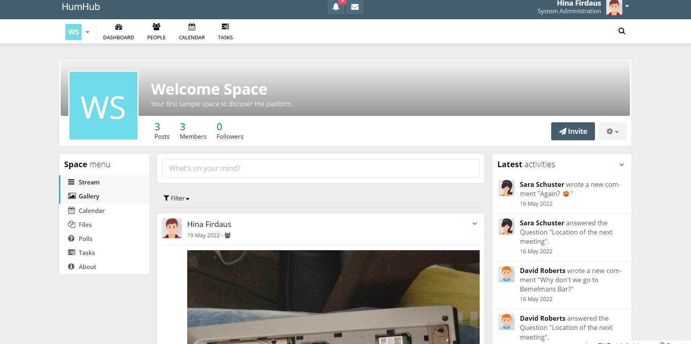

# humhubGallery_Hina
I have created a gallery to upload the photos from space to mysql.
### SpaceController -> Integrated gallery into the space instead of creating a separate module which will require a good understanding of View
### Gallery -> model for interacting the action given by controller
### gallery -> part of view for making the action done
The database is created in mysql. I think it need updation in migration too. Which can be done very soon

